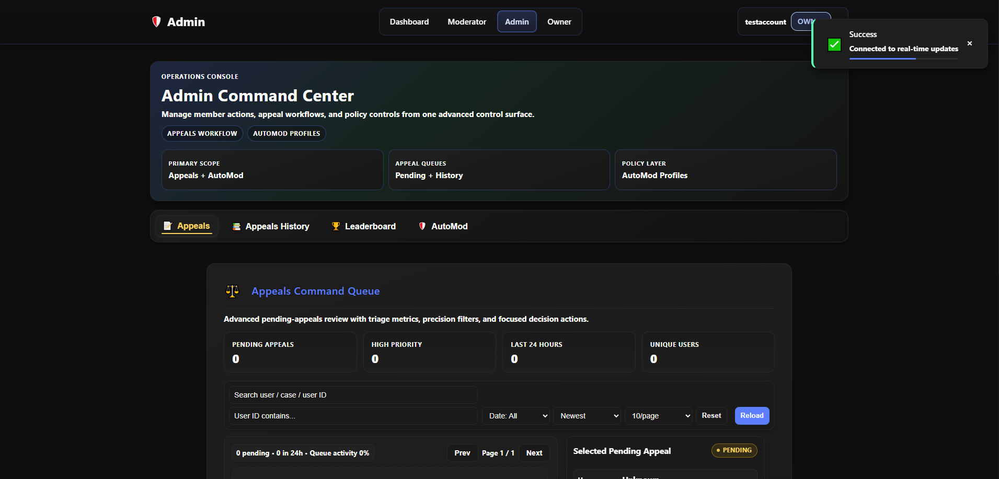
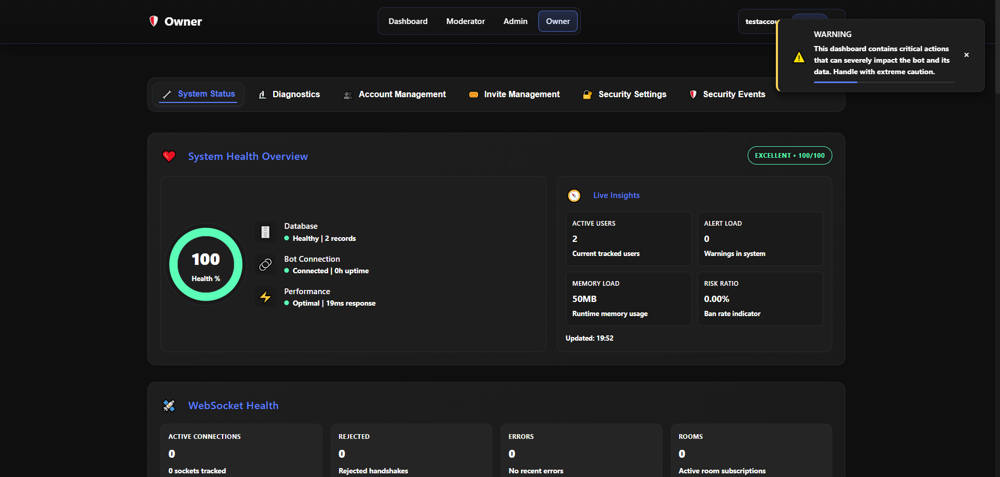
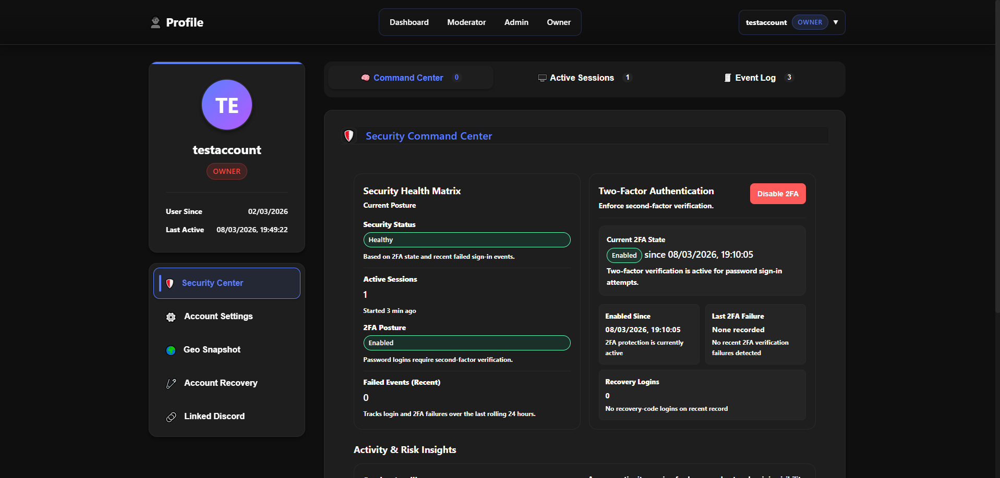

# Sentinel Discord Bot

Sentinel is a full‑stack Discord moderation and community platform with a production‑ready bot and a dedicated Admin Panel. It focuses on reliability, clear moderation workflows, and configurable automation so staff teams can run large servers without constant manual work. The bot is designed to run a single server at a time.

## ✨ Features

- Moderation suite: auto‑mod, logging, anti‑raid tools, and case tracking
- Ticketing system with staff workflows and audit history
- Verification flows, risk scoring, and analytics
- Leveling, community utilities, and quality‑of‑life commands
- Admin Panel dashboard for configuration, insights, and secure tooling
- Music playback with queue controls and reliability fallbacks
- Join‑to‑Create voice channels with ownership transfer and auto‑cleanup

## ✅ Requirements

- Node.js v18+
- A MySQL database (most features rely on it)
- A Discord application with privileged gateway intents enabled
- Designed to run one server at a time

## 🚀 Quick Start

1. Install dependencies:
   ```bash
   npm install
   ```
2. Configure environment values in `Config/credentials.env`.
   - Required: bot token, client ID, guild ID, and MySQL credentials.
   - Optional: Admin Panel OAuth and email settings.
3. Update `Config/main.json` with your server links and branding (server name, website link, etc.).
4. Start the bot:
   ```bash
   npm start
   ```
5. Start the Admin Panel (optional):
   ```bash
   npm run admin
   ```
   By default it serves on `http://localhost:3000` unless `ADMIN_PORT` is set.

## ⚙️ Privileged Gateway Intents

Sentinel needs privileged intents for moderation, verification, and member workflows.

1. Go to the [Discord Developer Portal](https://discord.com/developers/applications)
2. Select your application → **Bot**
3. Enable:
   - ✅ Presence Intent
   - ✅ Server Members Intent
   - ✅ Message Content Intent
4. Save your changes.

## 🔐 Inviting the Bot

**Option 1: Administrator (recommended)**
This ensures the bot can manage channels for tickets, assign roles, kick/ban users, and delete messages without “Missing Access” errors.
**🔗 [Invite Bot (Admin)](https://discord.com/oauth2/authorize?client_id=YOUR_CLIENT_ID_HERE&permissions=8&scope=bot%20applications.commands)**

**Option 2: Specific Permissions**
If you prefer not to grant Administrator, this link requests granular permissions used across modules.
**🔗 [Invite Bot (Specific)](https://discord.com/oauth2/authorize?client_id=YOUR_CLIENT_ID_HERE&permissions=1384074218358&scope=bot%20applications.commands)**

*(Replace `YOUR_CLIENT_ID_HERE` with your bot’s Client ID.)*

## 🧩 Configuration Overview

- **Environment file:** `Config/credentials.env`
  - Bot token, client ID, guild ID
  - MySQL connection details
  - Admin Panel OAuth + email settings (optional)
- **Constants:** `Config/constants/*.json`
  - Channels, roles, rules, automod policies, leveling, and misc behavior

## 🗄️ Database

Sentinel uses MySQL for tickets, moderation history, verification, and analytics.

```bash
npm run migrate
```

## 🧭 Admin Panel Notes

- Start with `npm run admin`.
- For production, set `ADMIN_PORT`, `ADMIN_ORIGIN`, and `ADMIN_ALLOWED_HOSTS` in `Config/credentials.env`.
- Keep OAuth redirect URLs in sync with your Admin Panel origin.

## 🧪 Useful Scripts

- `npm start` — run the bot
- `npm run admin` — run the Admin Panel
- `npm run migrate` — apply DB migrations
- `npm run safety:check` — run safety checks

## 🐛 Troubleshooting

- **Missing Access when registering commands:** ensure the invite link includes `applications.commands` and that your bot is in the correct guild.
- **Commands not responding:** verify privileged intents are enabled in the Developer Portal.
- **Admin Panel login issues:** confirm OAuth credentials and `ADMIN_ORIGIN`.

## 🖼️ Screenshots




