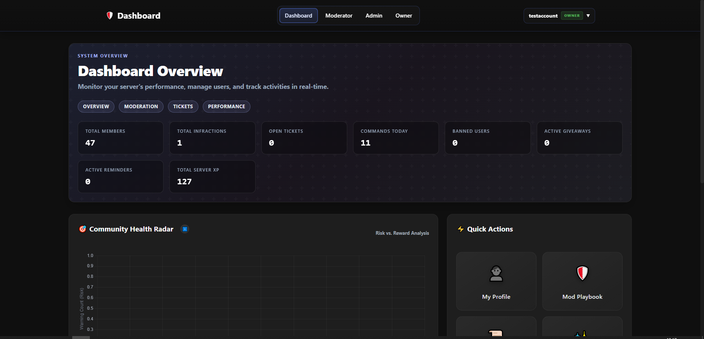
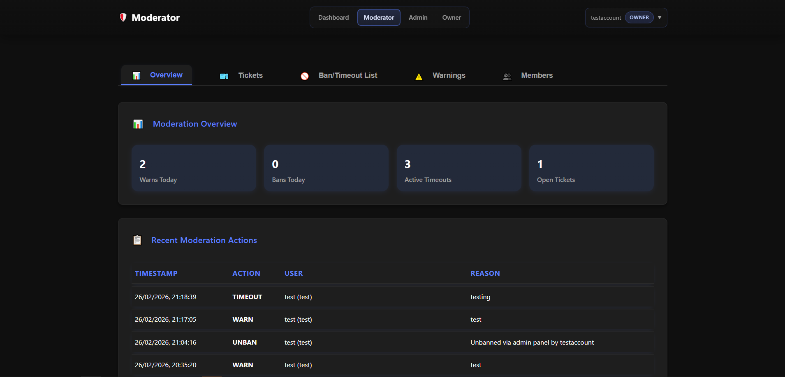
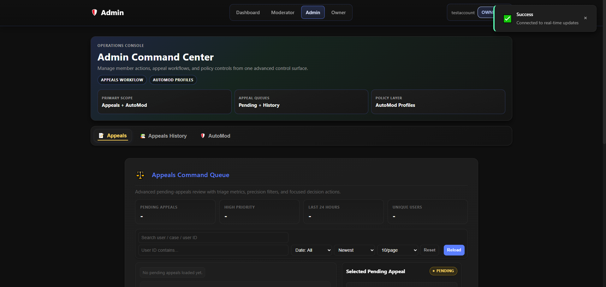
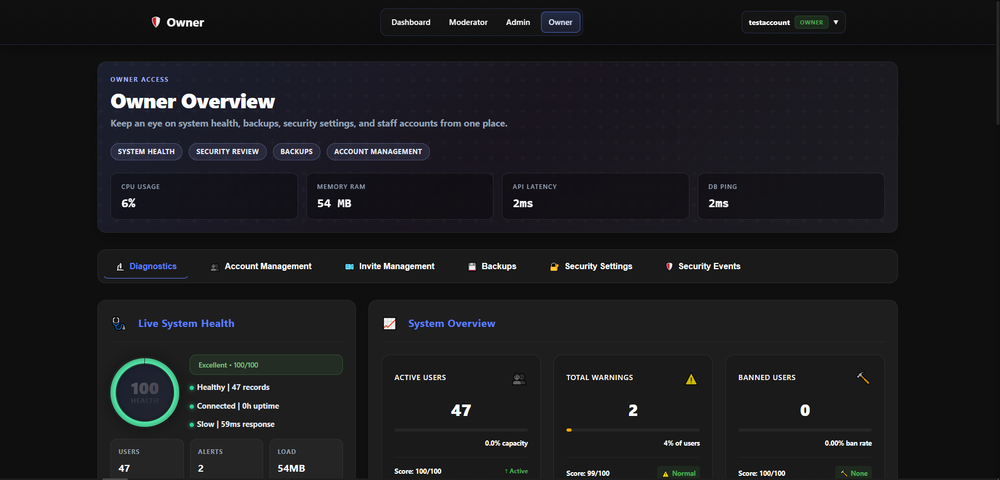
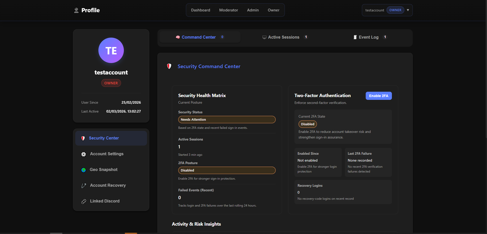
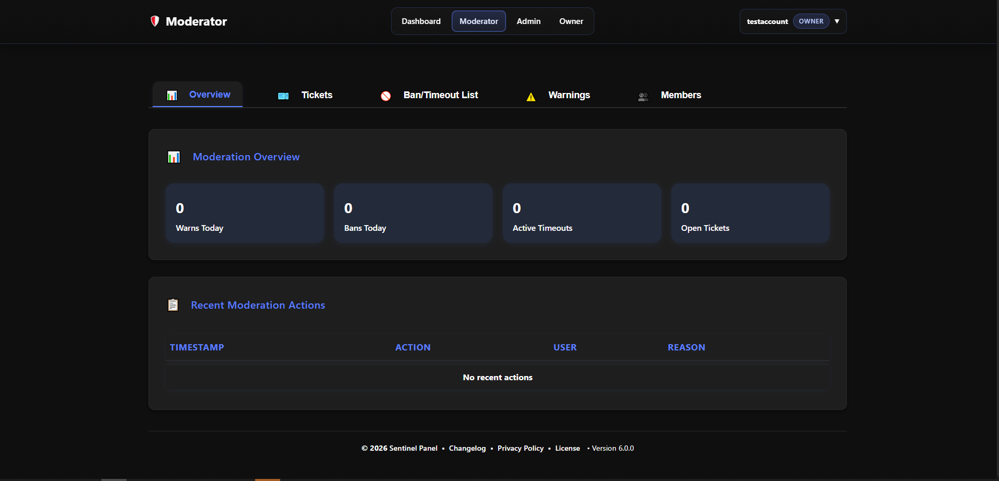

# Sentinel Discord Bot

Sentinel is a full‑stack Discord moderation and community platform with a production‑ready bot and a dedicated Admin Panel. It focuses on reliability, clear moderation workflows, and configurable automation so staff teams can run large servers without constant manual work. The bot is designed to run a single server at a time.

## 🎯 Scope

Sentinel is designed for one Discord server at a time.

- It is not a multi-tenant public bot platform.
- Configuration, role mapping, moderation flows, and panel behavior assume a single managed community per deployment.

## ✨ Features

- Moderation suite: auto‑mod, logging, anti‑raid tools, and case tracking
- Ticketing system with staff workflows and audit history
- Verification flows, risk scoring, and analytics
- Leveling, community utilities, and quality‑of‑life commands
- Admin Panel dashboard for configuration, insights, and secure tooling
- Music playback with queue controls and reliability fallbacks
- Join‑to‑Create voice channels with ownership transfer and auto‑cleanup

## ✅ Requirements

- Node.js v18+
- A MySQL database (most features rely on it)
- A Discord application with privileged gateway intents enabled
- Designed to run one server at a time

## 🚀 Quick Start

1. Install dependencies:
   ```bash
   npm install
   ```
2. Configure environment values in `Config/credentials.env`.
   - Required for the bot: `BOT_TOKEN`, `CLIENT_ID`, `GUILD_ID`, `MYSQL_HOST`, `MYSQL_PORT`, `MYSQL_USER`, `MYSQL_PASSWORD`, and `MYSQL_DATABASE`.
   - Required for Discord OAuth account linking: `DISCORD_OAUTH_CLIENT_SECRET` and, if you are not using the runtime fallback, `DISCORD_OAUTH_REDIRECT_URI`.
   - Recommended for production Admin Panel deployments: `ADMIN_PORT`, `ADMIN_ORIGIN`, and `ADMIN_ALLOWED_HOSTS`.
   - Optional: SMTP/email settings for notifications and account flows.
3. Update the main config files before first run.
   - `Config/main.json`: branding, invite links, server metadata, and public-facing links.
   - `Config/constants/*.json`: roles, channels, moderation rules, leveling settings, and other server-specific behavior.
   - `Config/presence.json` and `Config/backups.json`: bot presence and backup defaults if you plan to use those systems.
4. Start the bot first:
   ```bash
   npm start
   ```
   This also initializes the MySQL schema automatically on startup.
5. Start the Admin Panel (optional):
   ```bash
   npm run admin
   ```
   By default it serves on `http://localhost:3000` unless `ADMIN_PORT` is set.
6. Create your first panel account if needed:
   ```bash
   npm run account:create
   ```

## ⚙️ Privileged Gateway Intents

Sentinel needs privileged intents for moderation, verification, and member workflows.

1. Go to the [Discord Developer Portal](https://discord.com/developers/applications)
2. Select your application → **Bot**
3. Enable:
   - ✅ Presence Intent
   - ✅ Server Members Intent
   - ✅ Message Content Intent
4. Save your changes.

## 🔐 Inviting the Bot

**Option 1: Administrator (recommended)**
This ensures the bot can manage channels for tickets, assign roles, kick/ban users, and delete messages without “Missing Access” errors.
**🔗 [Invite Bot (Admin)](https://discord.com/oauth2/authorize?client_id=YOUR_CLIENT_ID_HERE&permissions=8&scope=bot%20applications.commands)**

**Option 2: Specific Permissions**
If you prefer not to grant Administrator, this link requests granular permissions used across modules.
**🔗 [Invite Bot (Specific)](https://discord.com/oauth2/authorize?client_id=YOUR_CLIENT_ID_HERE&permissions=1384074218358&scope=bot%20applications.commands)**

*(Replace `YOUR_CLIENT_ID_HERE` with your bot’s Client ID.)*

## 🧩 Configuration Overview

- **Environment file:** `Config/credentials.env`
  - Bot token, client ID, guild ID
  - MySQL connection details
  - Admin Panel OAuth + email settings (optional)
- **Constants:** `Config/constants/*.json`
  - Channels, roles, rules, automod policies, leveling, and misc behavior

## 🗄️ Database

Sentinel uses MySQL for tickets, moderation history, verification, analytics, panel sessions, and more.

- There is currently no separate migration command in `package.json`.
- The schema is created and updated automatically when the bot starts.
- On startup, the MySQL layer creates core tables, extended feature tables, and applies in-code schema migrations for new columns and indexes.

Recommended first-run flow:

1. Create an empty MySQL database.
2. Put the connection details in `Config/credentials.env`.
3. Run `npm start` once to let Sentinel initialize the schema.
4. After the bot connects successfully, start the Admin Panel with `npm run admin`.

## 🧭 Admin Panel Notes

- Start with `npm run admin`.
- For production, set `ADMIN_PORT`, `ADMIN_ORIGIN`, and `ADMIN_ALLOWED_HOSTS` in `Config/credentials.env`.
- Keep OAuth redirect URLs in sync with your Admin Panel origin.

## 🔐 Admin Panel Access And Discord OAuth

The Admin Panel now relies much more heavily on linked Discord identity than earlier versions.

- Discord account linking is handled through OAuth.
- If Discord OAuth is not fully configured, linking remains disabled until the required values are added to `Config/credentials.env`.
- Some panel features require a linked Discord account that matches the server and trusted role requirements.
- Moderator, admin, and owner-only panel areas can depend on Discord role validation, not just the local panel account role.
- If `DISCORD_OAUTH_REQUIRE_GUILD_MEMBER` is enabled, the linked Discord account must also be a member of the configured server.
- For production, make sure `ADMIN_ORIGIN` and the Discord OAuth redirect URL point to the same real panel origin.

## 🏗️ Project Structure

- `index.js` — main Discord bot entry point.
- `adminPanel.js` — Admin Panel server entry point.
- `Commands/` — slash commands and command modules grouped by feature.
- `Events/` — Discord event handlers and listeners.
- `Functions/` — shared services, helpers, MySQL logic, moderation helpers, music management, verification helpers, and panel support utilities.
- `AdminPanel/` — panel views, public scripts, styles, images, and static assets.
- `Config/` — environment/config JSON files, presence settings, backups config, and constants.
- `Logging/` — audit/event logging handlers.
- `scripts/` — utility scripts such as account creation and email template sending.

## 🧪 Useful Scripts

- `npm start` — run the bot
- `npm run admin` — run the Admin Panel
- `npm run account:create` — create an Admin Panel account
- `npm run email:send-all-templates` — send all email templates for verification/testing
- `npm test` — placeholder script; no automated test suite is currently configured

## 🚧 Feature Status

Most core moderation, panel, and utility systems are production-oriented, but a few areas are still actively being refined.

- Stable core areas: moderation workflows, logging, tickets, verification, leveling, music, and core Admin Panel access.
- Still evolving: server backups, anti-raid tuning, Discord OAuth trust enforcement, and some newer panel security/session flows.
- Expect some newer systems to improve over time without always being fully finalized yet.

## 🐛 Troubleshooting

- **Missing Access when registering commands:** ensure the invite link includes `applications.commands` and that your bot is in the correct guild.
- **Commands not responding:** verify privileged intents are enabled in the Developer Portal.
- **Admin Panel login issues:** confirm OAuth credentials and `ADMIN_ORIGIN`.

## 🙏 Credits

- Credit to [oa1u](https://github.com/oa1u)
- Credit to [Bruno](https://github.com/brunocendan06-web)
- Powered by `discord.js`, `Express`, `MySQL`, `Socket.IO`, and related open-source tooling used throughout the bot and Admin Panel.
- Music and media support rely on the voice, streaming, and FFmpeg-based libraries included in the project dependencies.
- Thanks to the open-source ecosystem that supports Discord bots, moderation tooling, and web panel development.

## 🖼️ Screenshots






