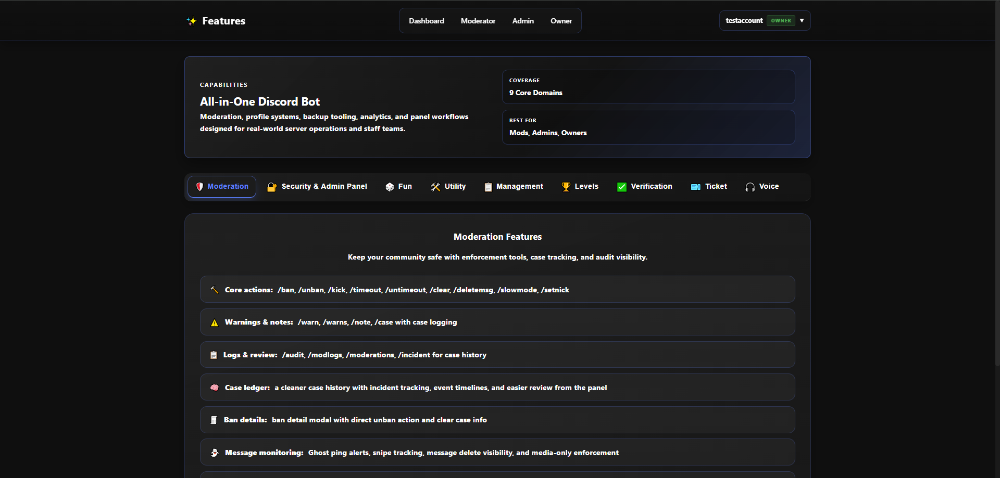
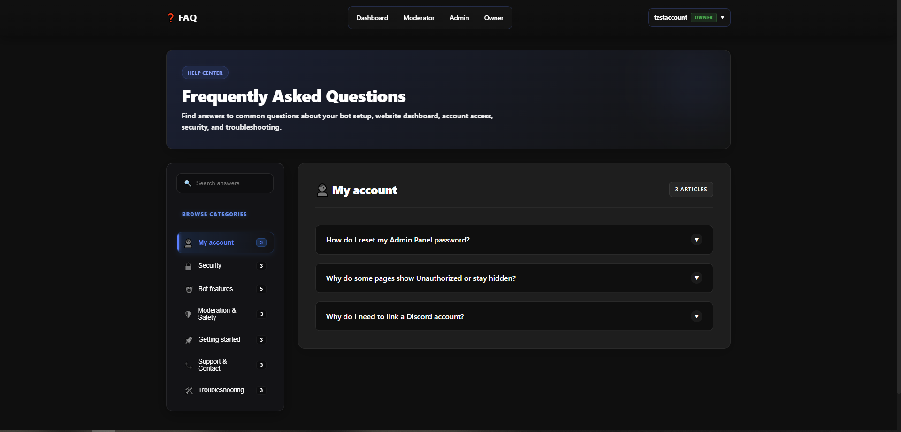
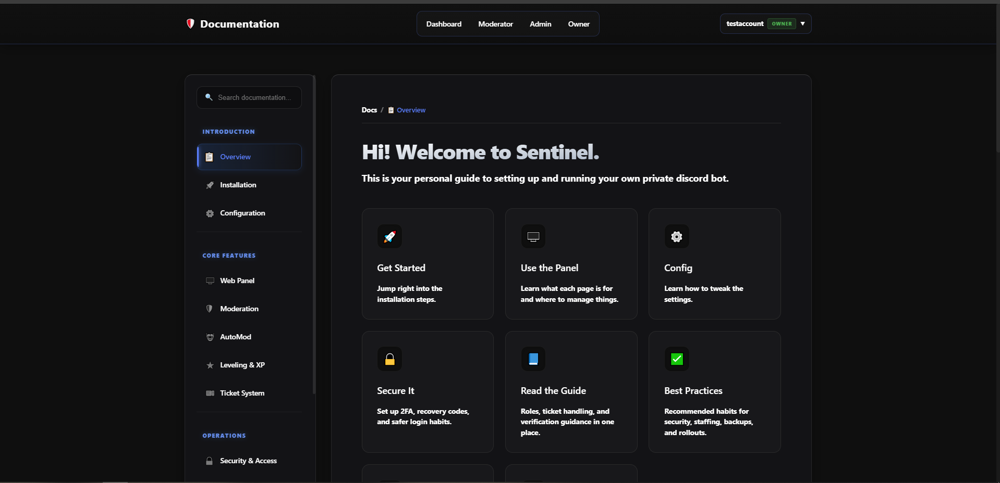

# Sentinel Discord Bot

Sentinel is a Discord bot and Admin Panel built for running one server well. It focuses on moderation, tickets, verification, automation, and the staff tools that go with them.

This project is meant for a single community per deployment, not a public multi-server bot.

## What It Includes

- Moderation tools, logging, anti-raid checks, and case tracking
- Tickets, verification, analytics, and staff workflows
- Leveling, utilities, music, and join-to-create voice channels
- A web-based Admin Panel for settings, insights, and account-linked access

## Requirements

- Node.js 18+
- MySQL
- A Discord application with privileged gateway intents enabled

## Quick Start

1. Install dependencies.
   ```bash
   npm install
   ```
2. Fill out `Config/credentials.env`.
   Required bot values:
   `BOT_TOKEN`, `CLIENT_ID`, `GUILD_ID`, `MYSQL_HOST`, `MYSQL_PORT`, `MYSQL_USER`, `MYSQL_PASSWORD`, `MYSQL_DATABASE`

   If you want Discord account linking in the panel, also set:
   `DISCORD_OAUTH_CLIENT_SECRET`

   For production panel setups, also set:
   `ADMIN_PORT`, `ADMIN_ORIGIN`, `ADMIN_ALLOWED_HOSTS`
3. Update the server config files.
   - `Config/main.json`
   - `Config/constants/*.json`
   - `Config/presence.json` and `Config/backups.json` if you use those features
4. Start the bot.
   ```bash
   npm start
   ```
   The database schema is created and updated automatically on startup.
5. Start the Admin Panel if you want it.
   ```bash
   npm run admin
   ```
6. Create a panel account if needed.
   ```bash
   npm run account:create
   ```

## Discord Setup

In the [Discord Developer Portal](https://discord.com/developers/applications), enable these intents for the bot:

- Presence Intent
- Server Members Intent
- Message Content Intent

## Admin Panel And OAuth

The Admin Panel now depends much more on linked Discord accounts than older versions did.

- Some panel pages check both the local panel role and the linked Discord account
- OAuth-based linking stays disabled until the required values are set in `Config/credentials.env`
- In production, your `ADMIN_ORIGIN` and OAuth redirect URL need to match

## Project Structure

- `index.js` - Discord bot entry point
- `adminPanel.js` - Admin Panel entry point
- `Commands/` - slash commands by feature
- `Events/` - Discord event handlers
- `Functions/` - shared helpers and services
- `AdminPanel/` - panel views, scripts, styles, and assets
- `Config/` - environment and server-specific config
- `Logging/` - logging handlers
- `scripts/` - setup and utility scripts

## Useful Scripts

- `npm start` - run the bot
- `npm run admin` - run the Admin Panel
- `npm run account:create` - create a panel account
- `npm run email:send-all-templates` - send email templates for testing

`npm test` is currently just a placeholder. There is no proper automated test suite configured yet.

## Notes

- Sentinel is designed for one server at a time
- MySQL is required for most core features
- Some newer systems are still being refined, especially backups and anti-raid tuning.

## Troubleshooting

- If commands are not responding, check your privileged intents
- If command registration fails with Missing Access, make sure the bot was invited with `applications.commands`
- If panel login or linking fails, double-check your OAuth values and `ADMIN_ORIGIN`

## Credits

- [oa1u](https://github.com/oa1u)
- [Bruno](https://github.com/brunocendan06-web)
- Built with `discord.js`, `Express`, `MySQL`, `Socket.IO`, and other open-source tooling used across the bot and panel

## Screenshots




